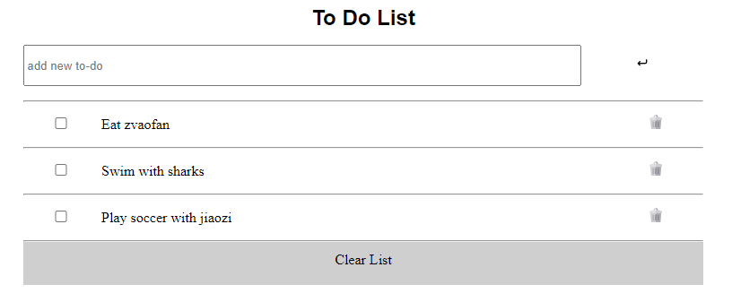

# To Do List

> Simple to-do-list made using webpack

## Built With

- HTML
- CSS
- Javascript
- Markdown
- WebPack

## Live Demo

> The live deploment of this website can seen via the 'npm' ***gh-pages*** view \
> The deployment will be a to-do-list \

## [Live Demo Link](https://tinatsina.github.io/to-do-list/)

## Getting Started

**Set up a linter for HTML, CSS and JS**

To get a local copy up and running follow these simple example steps.

1. Clone this repository or download the Zip folder:

**``git clone https://github.com/tinatsina/to-do-list.git``**

1. Navigate to the location of the folder in your machine:

**``you@your-Pc-name:~$ cd <folder>``**

**Git**
**Node JS (preferably any LTS version) for linters**

## Author

👤 **Tinaye Hamufari Tsinakwadi**

> Aspiring web developer mainly interested in minimal code. Research interests include Database design and IOT.

- [GitHub](https://github.com/tinatsina)
- [Twitter](https://twitter.com/TinayeT)
- [LinkedIn](https://www.linkedin.com/in/tinayetsina/)

Please feel free to contact me anytime

## Show your support

Give a ⭐️ if you like this project!

## Acknowledgments

- Hat tip to Microverse

## 📝 License

- This project is [Mozilla](./LICENSE) licensed.
